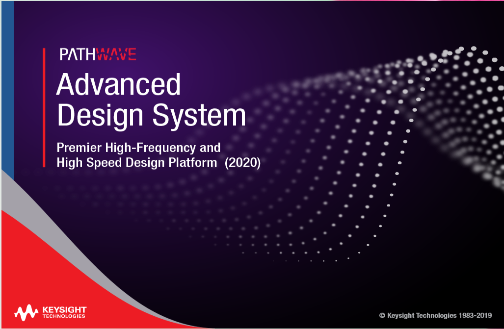

#   ADS 软件的基本介绍

先进设计系统(Advanced Design System)，简称ADS，是Keysight Technologies有限公司为适应竞争形势，为了高效的进行产品研发生产，而设计开发的一款EDA软件。

ADS 早期主要应用于微波射频电路方面的仿真 ，由于其仿真的灵活性、准确性以及优良的算法 ，仿真一直得到工程师的认可 。随着数字电路的发展，信号速率越来越高，电源的设计越来越复杂，所以ADS也被广泛地应用于数字电路的仿真中 。

对于板级电路的仿真，从原理图级的仿真到PCB板级的信号完整性和电源完整性仿真，都能在ADS中完成全流程设计。

>  参考书籍或文档 《ADS信号完整性仿真与实践》》