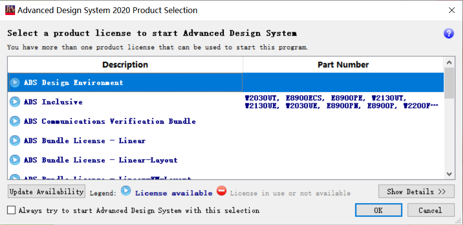
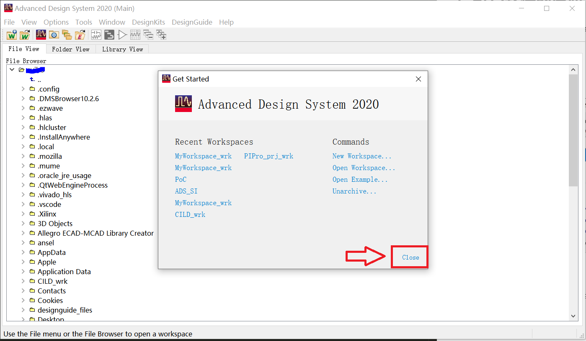
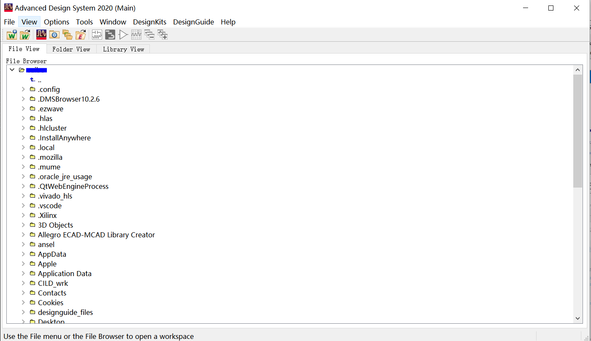

#   ADS 软件工程建立

##  一、ADS软件的启动

1. 双击桌面快捷方式图标 “Advanced Design System 2020  (64-bit Simulations)”

      

2. 弹出 ADS 产品选择对话框 ，选择 “ADS Design Environment ” ，点击 OK
         
    

3. 打开ADS软件的主界面 ，点击 “ Get Started ” 右下方的 “ Close ” 

    
    

##  二、新建工程

1. 点击 file > New > Workspace

    

2. 弹出 “ New Workspace ”对话框, 设置工程名称 ，工程路径 ，点击“Create Workspace” 创建工程

    

##  三、新建原理图

1. 点击 file > New > Schematic 

    

2. 弹出 “ New Schematic ” 对话框, 设置原理图名称 ，点击“Create Schematic” 创建工程原理图文件

    

3. 原理图界面如下

    

4. 点击原理图界面左侧的 “ Part ” 下拉框，选择器件，也可以进行搜索器件

    

5. 单击元器件，器件将粘附鼠标上 ，点击原理图空白处 ，放置元器件

    
    

>  参考书籍或文档 《ADS信号完整性仿真与实践》
